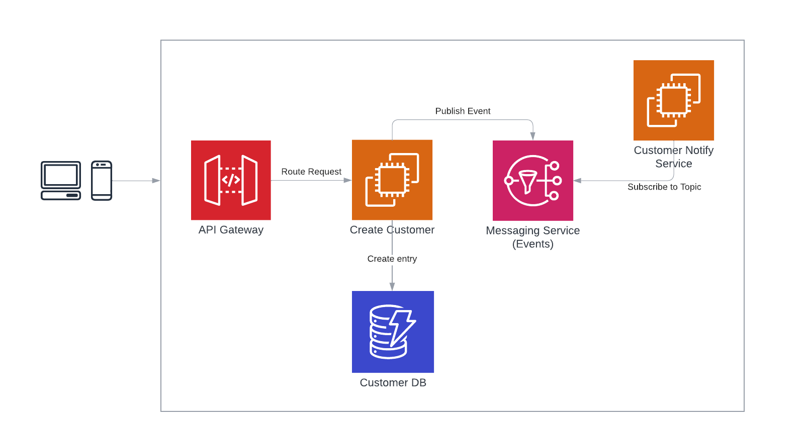

## Description

Event driven archictecture sample



## Usage

### Step 1: Install Nitric

<details>
 <summary>Prerequisites</summary>

- [Git](https://git-scm.com/)
- [Docker](https://docs.docker.com/get-docker/)
- [Pulumi](https://www.pulumi.com/docs/reference/cli/)

</details>

<details>
 <summary>MacOs</summary>

Install with [homebrew](https://brew.sh/)

```bash
brew install nitrictech/tap/nitric
```

</details>

<details>
 <summary>Windows</summary>

Install with [scoop](https://scoop.sh/)

```
scoop bucket add nitric https://github.com/nitrictech/scoop-bucket.git
scoop install nitric
```

</details>

<details>
 <summary>Linux</summary>
 
Download as a scripted install via curl.

```bash
curl https://nitric.io/install | bash

```

 </details>

<br/>

> Note: Complete installation guide can be found [here](https://nitric.io/docs/installation)

<br/>

### Step 2: AWS Configuration

```bash
mv .env-template .env
```

```
AWS_SES_REGION="us-east-1"
AWS_SES_ACCESS_KEY_ID="..."
AWS_SES_SECRET_ACCESS_KEY="..."

SENDER_EMAIL="..."
```

> Note: You'll need to whitelist these emails with amazon to send emails

### Step 3: Run the API locally with Nitric

```bash
yarn install
nitric run
```

### Step 4: Consume the API

```bash
curl --location --request POST 'http://127.0.0.1:9001/apis/public/customers' \
--header 'Content-Type: text/plain' \
--data-raw '{
    "firstname": "Test",
    "lastname": "User",
    "email" : "user@email.com"
}'
```

## What's next?

Explore the [Nitric framework](https://nitric.io/docs) to learn how to deploy to the cloud and much more.